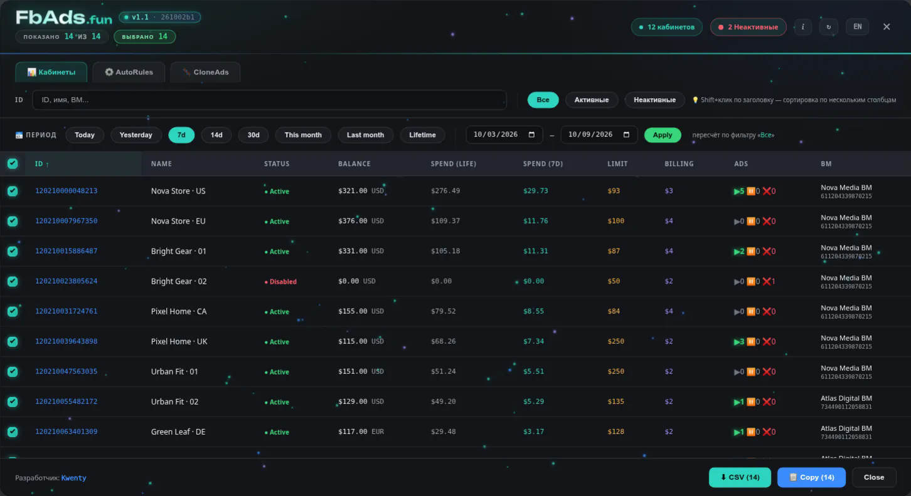
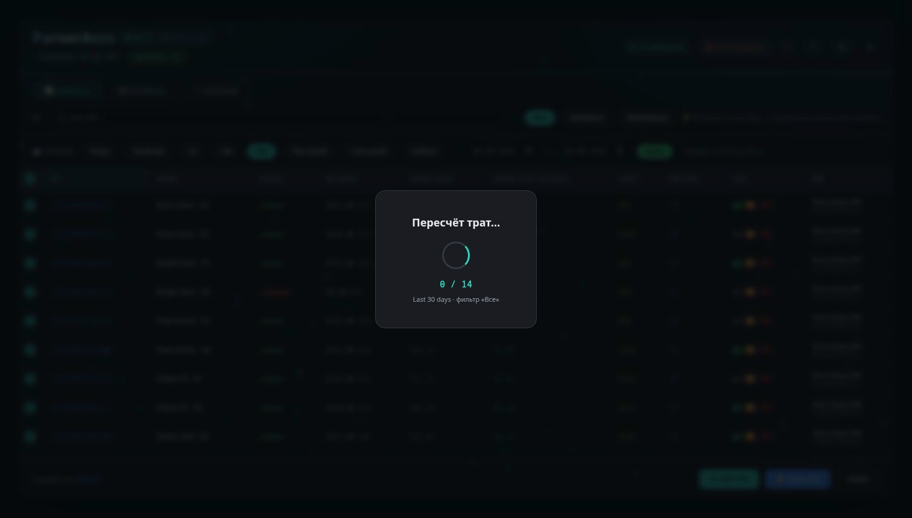
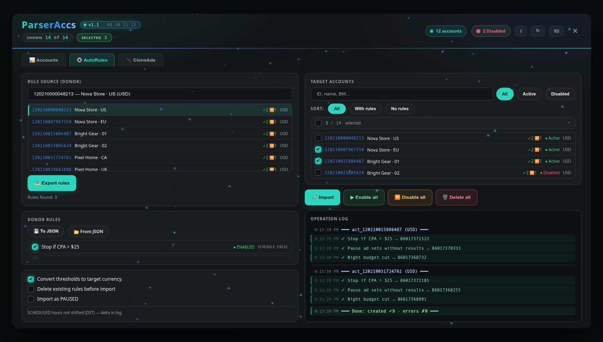
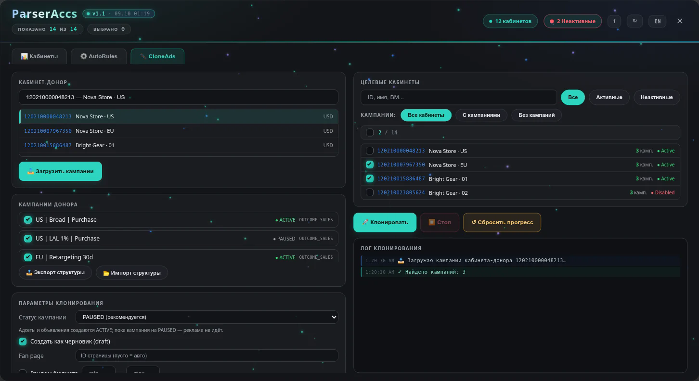
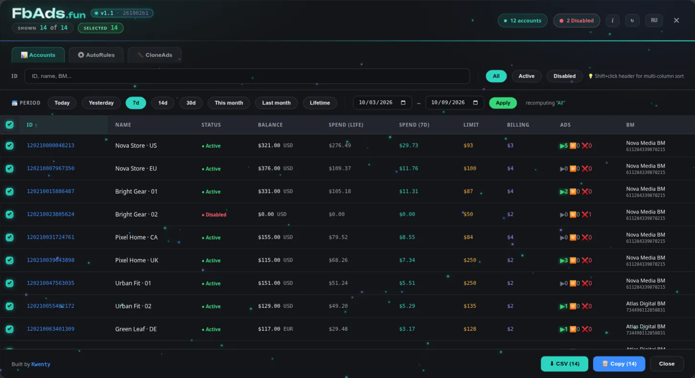

<div align="center">

# ParserAccs

**Одна закладка для массовой работы с Facebook Ads Manager**

Сводка по кабинетам · CSV · AutoRules · CloneAds

[](https://fbads.fun)
[](https://developers.facebook.com/docs/graph-api/)
[](LICENSE)

[Установка](#-установка) · [Возможности](#-возможности) · [Безопасность](#-безопасность) · [Разработка](#-разработка) · [English](#english)

</div>

---



<sub>Скриншоты сделаны на демо-данных: названия, ID и суммы вымышленные.</sub>

ParserAccs запускается прямо на странице Ads Manager и собирает рабочие инструменты в одном интерфейсе:

| Модуль | Назначение | Доступ |
|---|---|---|
| **📊 Кабинеты** | Балансы, траты, лимиты, биллинг, статусы, объявления и Business Manager | Только чтение |
| **⚙️ AutoRules** | Экспорт, перенос и массовое управление автоматическими правилами | Запись после подтверждения |
| **🧬 CloneAds** | Клонирование кампаний, адсетов, объявлений и креативов между кабинетами | **Beta**, запись после подтверждения |

> **Важно:** ParserAccs не является продуктом Meta и не связан с Facebook. Перед массовыми изменениями проверяйте выбранные кабинеты и параметры операции.

## ⚡ Установка

1. Откройте **[fbads.fun](https://fbads.fun)**.
2. Покажите панель закладок: `Ctrl + Shift + B` или `⌘ + Shift + B` на macOS.
3. Выберите язык **RU / EN**.
4. Перетащите кнопку **📌 ParserAccs** на панель закладок.
5. Откройте Facebook Ads Manager и нажмите созданную закладку.

Если перетаскивание недоступно, нажмите **«Скопировать код»**, создайте обычную закладку и вставьте код в поле URL.

### Автоматические обновления

В закладке хранится небольшой стабильный загрузчик, а не вся программа. При запуске он:

1. получает опубликованную версию ParserAccs;
2. проверяет SHA-256 содержимого;
3. сохраняет рабочую копию в `localStorage`;
4. использует кэш, если свежая версия временно недоступна.

После обновлений повторно устанавливать закладку не нужно.

## ✨ Возможности

### 📊 Кабинеты

- общая таблица всех доступных рекламных кабинетов;
- ID без приставки `act_`, включая **Copy IDs** и CSV;
- имя, статус, валюта, баланс и дневной лимит;
- траты за всё время и за выбранный период;
- Today, Yesterday, 7/14/30 дней, месяцы, Lifetime и произвольные даты;
- порог биллинга и привязанный Business Manager;
- количество активных и отклонённых объявлений;
- поиск, фильтры, сортировка по одной или нескольким колонкам;
- сохранение выделения при фильтрации и сортировке;
- экспорт выбранных строк в CSV для Excel;
- обновление данных без закрытия окна.

При смене периода траты пересчитываются прямо поверх таблицы — окно закрывать не нужно:



### ⚙️ AutoRules

Переносит автоматические правила из кабинета-донора в выбранные цели.

- выбор отдельных правил;
- фильтры и счётчики правил по кабинетам;
- импорт сразу в несколько целей;
- конвертация денежных порогов под валюту цели;
- импорт в состоянии `PAUSED`;
- массовое включение, выключение и удаление;
- экспорт и импорт структуры правил через JSON;
- подробный цветной лог операций.

> Время в правилах `SCHEDULED` не сдвигается автоматически: переходы на летнее время делают фиксированное смещение небезопасным. Разница часовых поясов выводится в лог для ручной проверки.



### 🧬 CloneAds — beta

Клонирует структуру выбранных кампаний из кабинета-донора в один или несколько целевых кабинетов.

- кампании, адсеты, объявления и креативы;
- экспорт и импорт структуры через JSON;
- сопоставление Fan Page, пикселя и Instagram;
- перенос изображений и мультиязычных ассетов, где это поддерживается API;
- статус кампании `PAUSED` или `ACTIVE`;
- безопасный режим создания как черновик;
- переопределение Fan Page и диапазона бюджета;
- нейминг: исходный, замена ID, Find/Replace или шаблоны с макросами;
- остановка операции, лог ошибок и защита от повторной обработки уже завершённых пар.

> **Рекомендуется:** оставляйте кампанию в статусе `PAUSED`, используйте draft и проверяйте кампанию, адсеты, страницы, пиксели, плейсменты, бюджеты и креативы в Ads Manager перед запуском. CloneAds экспериментальный: некоторые форматы и ограничения конкретного кабинета могут потребовать ручной доработки.



## 🔐 Безопасность

- Вкладка **Кабинеты** выполняет только запросы на чтение.
- AutoRules и CloneAds явно запрашивают подтверждение перед записью.
- Токен берётся из открытой сессии Ads Manager или вводится пользователем вручную.
- Токен не отправляется на сервер ParserAccs и используется только для запросов к Graph API от имени пользователя.
- Код проекта открыт для проверки; опубликованный payload проверяется по SHA-256.
- Для CloneAds по умолчанию рекомендуется `PAUSED` и draft.

## 🌐 Языки

Интерфейс лендинга и букмарклета поддерживает русский и английский. Язык установки задаётся переключателем **RU / EN** на лендинге; внутри ParserAccs его можно поменять без перезапуска.

## 🧩 Как устроена доставка

```text
src/*.js
   ↓ npm run build
parseraccs.js
   ↓ упаковка + SHA-256
manifest + Open Graph chunk
   ↓ Cloudflare Worker / fbads.fun
стабильный bookmarklet loader
```

Исходные модули собираются в единый payload. Cloudflare публикует лендинг и версионированный пакет после изменений в `main`. Загрузчик получает манифест и chunk, проверяет целостность и запускает код в Ads Manager.

Подробная инструкция по публикации: [HOSTING.md](HOSTING.md).

## 🛠 Разработка

Требуется Node.js 20+.

```bash
git clone https://github.com/Kw3nty/ParserAccs.git
cd ParserAccs
npm ci
npm run check
npm run build
```

Основные файлы:

```text
src/i18n.js       токен, переводы и общие данные
src/accounts.js   загрузка кабинетов и метрик
src/modal.js      каркас интерфейса
src/rules.js      AutoRules
src/clone.js      CloneAds
src/styles.js     дизайн интерфейса
src/bindings.js   события, таблица и экспорт
```

Полезные команды:

| Команда | Что делает |
|---|---|
| `npm run build:payload` | собирает `parseraccs.js` из `src/` |
| `npm run check` | проверяет актуальность и синтаксис сборки |
| `npm run build` | создаёт готовый каталог `dist/` |

### Публикация без Facebook scrape token

После нового деплоя обновите два адреса через [Facebook Sharing Debugger](https://developers.facebook.com/tools/debug/):

```text
https://fbads.fun/parseraccs/latest/manifest
https://fbads.fun/parseraccs/latest/og/chunk-001
```

Для каждого адреса нажмите **Fetch new information** или **Scrape Again**. Серверный Facebook-токен для этого не нужен.

## ☕ Поддержать проект

ParserAccs бесплатный, open-source и без рекламы. QR-коды и адреса USDT TRC-20 / ERC-20 находятся в разделе **«Донат»** на [fbads.fun](https://fbads.fun/#donate).

## 📄 Лицензия

[MIT](LICENSE) · Автор: [Kwenty](https://t.me/kw33nty)

---

<a id="english"></a>

## English

ParserAccs is a bookmarklet for Facebook Ads Manager with three modules:

- **Accounts** — read-only account reporting, date filters, selection, Copy IDs and Excel-ready CSV;
- **AutoRules** — cross-account automated-rules transfer with currency conversion and JSON import/export;
- **CloneAds (beta)** — campaign, ad set, ad and creative cloning with draft/PAUSED safety options, naming templates and operation logs.

Install it from **[fbads.fun](https://fbads.fun)** by dragging the ParserAccs button to the bookmarks bar. The installed bookmark uses a self-updating, SHA-256-verified loader, so it does not need to be reinstalled after every release.

CloneAds writes through the Graph API. Keep cloned campaigns **PAUSED**, use draft mode and review every result in Ads Manager before launch.

| Accounts | AutoRules | CloneAds |
|---|---|---|
|  |  |  |

Screenshots use demo data (fictional names, IDs and amounts).

See [HOSTING.md](HOSTING.md) for build and deployment details.
